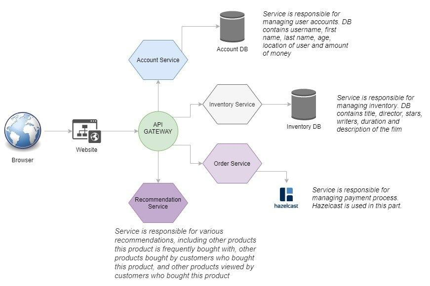

# FilmStore
System based on microservice architecture


The overall architecture is depicted below:



## Requirements

Project depends on:

* [Docker](https://www.docker.com/get-started)
* Any version of Linux OS (Recommended)

## Installation

For the first run, to build the system use file `initial_run.sh`:

```./initial_run.sh```

Later on use the following commands to stop/start the system:

```docker-compose stop```
```docker-compose start```

## License

MIT
